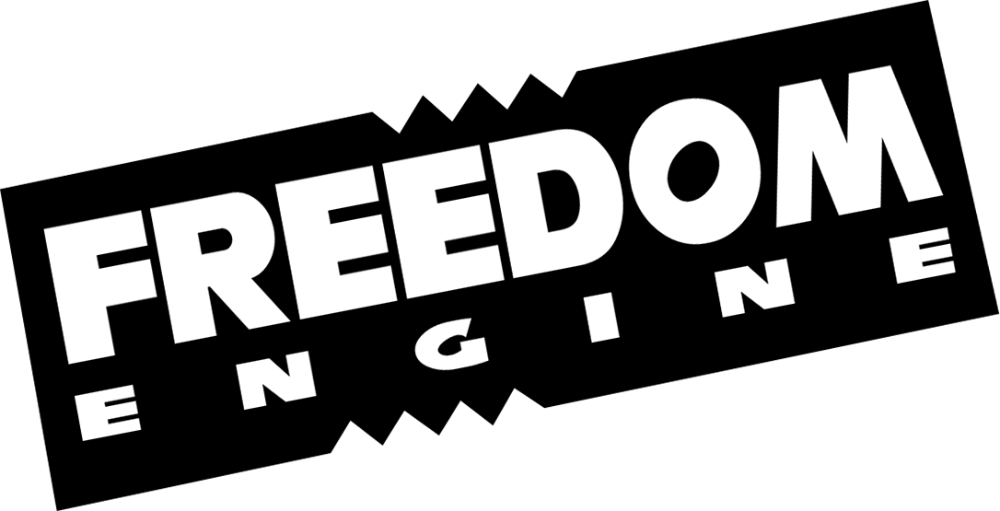

  
  

    
    
  

### How to download

If you don't know how to use git, click in "Code" button and then "Download Zip", you should be able to unzip the files without any softwares, if you don't, you'll need 7zip or winrar to unpack it.

### How to open

You need Unity to be able to open it. <a href="https://www.google.com/search?ei=lO6hXraWC9e85OUPp6mN-Ak&q=How+to+open+unity+projects&oq=How+to+open+unity+projects&gs_lcp=CgZwc3ktYWIQDDIECAAQRzIECAAQRzIECAAQRzIECAAQRzIECAAQRzIECAAQRzIECAAQRzIECAAQR1AAWABg2ZQBaABwBngAgAEAiAEAkgEAmAEAqgEHZ3dzLXdpeg&sclient=psy-ab&ved=0ahUKEwi2sLKVpv_oAhVXHrkGHadUA58Q4dUDCAw">How to open unity projects.</a>

**This project contains .blend files. You need Blender 2.8 installed on your machine to be able to open it.**

### How to use it

To use the project you will need at least some basic Unity skills. <a href="https://learn.unity.com/">Learn Unity first.</a>

### Special thanks to

Tripplejaz, Murasaki, Tpot, LapperDev, Lange, Damizean

### License

Models, sounds and sprites are property of **SEGA**, do not use them for commercial projects. Scripts are under <a href="LICENSE.txt">MIT License</a>.
